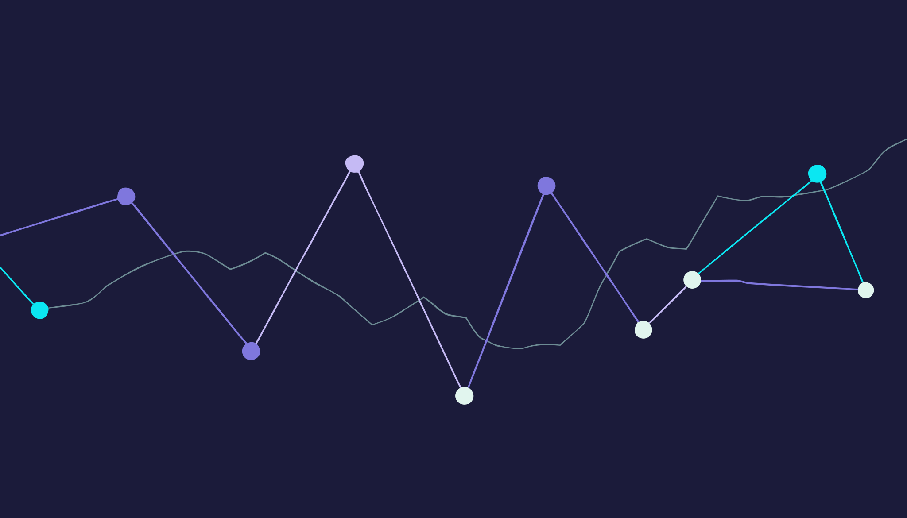
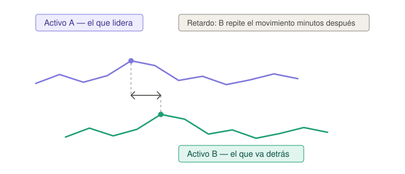
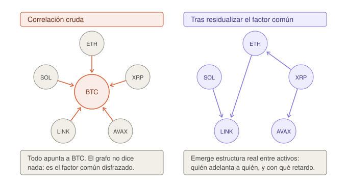
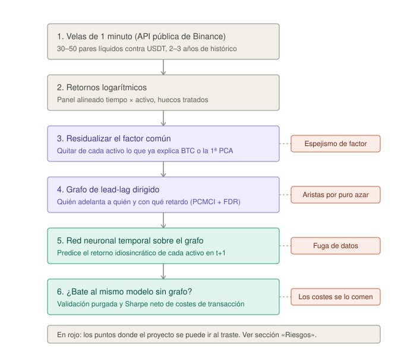

# Red de *lead-lag* entre criptoactivos

### Descubrimiento causal y redes de grafos temporales para detectar qué activo se mueve antes que cuál — y si eso sirve para algo

**Trabajo de Fin de Máster** · Máster en Inteligencia Artificial aplicada a los Mercados Financieros (Instituto BME)

**Estado:** propuesta aprobada internamente · fase de ingesta de datos

---

## 1. En una frase

Queremos saber si **hay criptomonedas que se mueven sistemáticamente antes que otras**, y si esa ventaja temporal —una vez descontado el arrastre de Bitcoin— se puede convertir en una predicción que sobreviva a las comisiones.

Si la respuesta es que sí, tenemos una señal. Si es que no, tenemos una refutación rigurosa de algo que mucha gente asume sin comprobarlo. **Las dos respuestas valen.**

---

## 2. El problema, desde cero

### 2.1. Qué es el *lead-lag*

Imagina dos activos, A y B. Si **cada vez** que A sube, B sube tres minutos después de forma consistente, decimos que *A adelanta a B*. Esa asimetría temporal es información pura: observando A, anticipas B.



En mercados tradicionales el fenómeno está muy documentado —los futuros sobre índice suelen adelantar a las acciones individuales—. En cripto existe, pero está mal caracterizado y casi siempre mal medido.

### 2.2. Por qué cripto y no renta variable

| Motivo | Detalle |
|---|---|
| **Datos gratis y granulares** | La API pública de Binance sirve velas de 1 minuto de cientos de pares, con años de histórico y sin autenticación. |
| **Mercado 24/7** | No hay sesiones, huecos nocturnos ni cierres de fin de semana. Desaparece una fuente enorme de artefactos estadísticos. |
| **Activos persistentes** | ETH existe de forma continua durante años. El conjunto de nodos del grafo es estable, a diferencia de mercados donde los contratos expiran. |

### 2.3. Por qué no es trivial: el espejismo de factor

Aquí está el nudo del trabajo. **La correlación ingenua miente.**

En cripto casi todo se mueve con Bitcoin. Si mides relaciones a pelo, "descubres" que todo está conectado con todo —el resultado más inútil posible—. No has encontrado estructura: has encontrado a Bitcoin, disfrazado de cincuenta flechas.



El reto real es **separar el movimiento propio de cada activo del factor común**, y solo entonces preguntar quién adelanta a quién. Es exactamente el problema del *Factor Mirage* descrito por López de Prado y Zoonekynd: confundir una causa común con una relación directa entre dos efectos.

---

## 3. Pregunta de investigación

> **¿Existen relaciones de *lead-lag* estables y estadísticamente significativas entre los retornos idiosincráticos de criptoactivos? Y si existen, ¿aporta modelarlas como un grafo temporal un valor predictivo y económico superior al de tratar cada activo por separado?**

**Sub-preguntas**

1. ¿Las relaciones persisten fuera de muestra, o son inestables y dependientes del régimen de mercado?
2. ¿Sobreviven al control del factor común (BTC / primera componente principal)?
3. ¿El valor predictivo estadístico se traduce en valor económico **después** de costes y *slippage*?

**Hipótesis nula (falsable)**

> *H₀ — una red de grafos temporal construida sobre el grafo de lead-lag no mejora de forma significativa, fuera de muestra, a un modelo univariante equivalente.*

El TFM consiste en intentar rechazar H₀ con honestidad metodológica.

---

## 4. Qué lo diferencia de "otro notebook que predice Bitcoin"

Hay miles de trabajos de "predecir el precio de BTC con una LSTM". Este no es eso. La diferencia está en cuatro decisiones que la mayoría omite:

| Lo que se suele hacer | Lo que hacemos | Por qué importa |
|---|---|---|
| Correlación de Pearson cruda | *Lead-lag* sobre retornos **residualizados** del factor común | Evita el espejismo de factor; mide relación real, no arrastre de BTC |
| Asumir grafo estático | Grafo **dinámico** por ventanas + análisis de estabilidad | Las correlaciones cripto colapsan en estrés; medir esa inestabilidad **es parte del resultado** |
| Tratar correlación como causalidad | **Descubrimiento causal temporal** (PCMCI) condicionando sobre el pasado de todas las series | Distingue causa directa de confusión y de cadenas indirectas |
| Métrica solo estadística | Validación **purgada** + test económico **neto de costes** | Es donde se desmorona la mayoría de las "estrategias ganadoras" |

El aporte no es una arquitectura más potente. Es **rigor**: usar las herramientas correctas para responder bien una pregunta que casi nadie responde bien.

---

## 5. Metodología



### 5.1. Datos

- **Fuente:** API REST pública de Binance (`/api/v3/klines`, y `/api/v3/aggTrades` si hiciera falta bajar de resolución).
- **Universo:** 30–50 pares contra USDT, filtrados por liquidez y antigüedad mínima de cotización. Diversificados por categoría (L1, L2, DeFi, memecoins) para que las relaciones sean potencialmente interesantes y no triviales.
- **Volumen:** ~525.000 velas de 1 minuto por par y año. Con 30–50 pares y 2–3 años, **decenas de millones de observaciones**.
- **Cacheo obligatorio en Parquet.** El histórico es inmutable: se descarga una vez y se trabaja en local. Evita horas de espera y baneos de IP.

### 5.2. Residualización del factor común

El paso que define el trabajo. Antes de buscar quién adelanta a quién, se elimina de cada activo la parte explicada por el mercado. Sin esto, el grafo resultante es "todos conectados con BTC" y no hay nada que modelar.

El factor común admite tres definiciones —retorno de BTC, media transversal, o primera componente principal—. **Compararlas y reportar la sensibilidad del resultado a esa elección es parte del entregable**, no un detalle de implementación.

### 5.3. Construcción del grafo

Dos enfoques complementarios, de menor a mayor sofisticación:

**(a) Línea base transparente.** Correlación cruzada con retardo entre residuos. Una arista dirigida `i → j` existe si el pico de correlación se da en un retardo positivo significativo. Con N activos y L retardos se hacen miles de contrastes, así que la corrección por multiplicidad (FDR de Benjamini-Hochberg) no es opcional.

**(b) Descubrimiento causal temporal (PCMCI).** La correlación cruzada no distingue una causa directa de una cadena indirecta: si A→B→C, también aparecerá A→C. PCMCI condiciona sobre el pasado de *todas* las series y filtra esas relaciones espurias. Es el estado del arte en descubrimiento causal para series temporales.

De ahí sale la **matriz de adyacencia ponderada** que alimenta al modelo.

### 5.4. Modelo predictivo

Una red de grafos temporal (arquitectura tipo A3TGCN: convolución sobre grafo más atención temporal) predice el retorno idiosincrático de cada nodo en `t+1` usando su propio historial **y el de sus vecinos adelantados**.

*Features* por nodo: retornos idiosincráticos rezagados, volatilidad realizada en ventana, volumen normalizado y número de operaciones como proxy de actividad.

### 5.5. Baselines — la parte que realmente decide el TFM

El modelo de grafos solo "gana" si bate a alternativas justas:

1. **Martingala.** Predicción constante igual a cero: el mejor estimador si el mercado es eficiente.
2. **AR(p) por activo.** Univariante, ignora el grafo.
3. **VAR multivariante.** Captura dependencias lineales entre activos, sin estructura de grafo aprendida.
4. **LSTM por activo, sin grafo.** *El baseline clave.*

El cuarto es el juez. Aísla la pregunta real: **¿la mejora viene de la estructura del grafo, o simplemente de haber usado una red neuronal?** Si el modelo de grafos no bate a una red equivalente sin grafo, la estructura no aporta y el TFM lo dirá.

---

## 6. Evaluación

### 6.1. Validación sin fuga de datos

El error número uno en finanzas es la **fuga de información**: solapar ventanas de entrenamiento y test, o normalizar usando estadísticas del futuro. Usamos validación *walk-forward* con **purga y embargo** (López de Prado).

> **Regla de oro del proyecto.** Toda transformación que use estadísticas —medias, betas, escalados, **y el propio grafo**— se ajusta *solo* con datos de entrenamiento y se aplica al test. La residualización y la construcción del grafo se recalculan **dentro de cada fold**, nunca sobre la muestra completa.

### 6.2. Métricas estadísticas

- **MAE / RMSE** del retorno previsto.
- **Information Coefficient (IC):** correlación de Spearman entre previsto y realizado, métrica estándar para señales de sección cruzada.
- **Test de Diebold-Mariano** para contrastar la diferencia de precisión frente al baseline, fold a fold.

### 6.3. Test económico

Una señal estadísticamente significativa puede ser **económicamente inútil** si el coste de operarla se la come. Construimos una cartera *long-short* dólar-neutral a partir de las predicciones y la evaluamos **neta de comisiones y slippage**, con la posición desplazada un periodo para no mirar al futuro.

Si el Sharpe neto no es claramente positivo y estable, la señal no es explotable. **Y eso también es un resultado.**

---

## 7. Riesgos conocidos

Esta es la sección que hay que tener siempre delante. Cada punto es un riesgo real de estancamiento, identificado *antes* de empezar.

| # | Riesgo | Mitigación |
|---|---|---|
| 1 | **Espejismo de factor.** Si no residualizamos bien, el grafo es "todo apunta a BTC" y no hay nada que modelar. | Probar varias definiciones de factor; verificar que las correlaciones medias caen drásticamente tras residualizar. Si no queda señal idiosincrática, el TFM pivota a demostrar precisamente eso. |
| 2 | **Inestabilidad y no estacionariedad.** Un grafo estimado en 2023 puede no valer en 2024. | Análisis explícito de estabilidad por ventanas y reentrenamiento *walk-forward*. **Medir la inestabilidad es parte del resultado, no un fallo que esconder.** |
| 3 | **Fuga de datos.** El asesino silencioso: produce backtests fantásticos e irreproducibles. | Purga y embargo; regla de oro de "ajustar solo en train". |
| 4 | **Lead-lag espurio por microestructura.** Con datos asíncronos y poco líquidos, el efecto Epps genera correlaciones cruzadas falsas. | Filtro de liquidez, estimador de Hayashi-Yoshida si se baja a tick, exigir significatividad tras FDR. |
| 5 | **Multiplicidad de tests.** Con 50 activos y 10 retardos hacemos unos 25.000 contrastes: por azar aparecerán cientos de aristas "significativas". | Corrección FDR-BH y validación de aristas fuera de muestra. |
| 6 | **¿Gana el grafo o gana la red?** Podemos atribuir al grafo un mérito que en realidad viene de la no-linealidad. | Baseline LSTM por activo (§5.5). Es el juez real de la hipótesis. |
| 7 | **Explotabilidad económica.** Aunque el lead-lag exista a escala de minutos, los bots de *market-making* probablemente ya lo arbitran. | Test económico neto. **Anticipamos que aquí mueren muchas señales; decirlo con datos es una conclusión sólida.** |
| 8 | **Sesgo de supervivencia.** Si solo incluimos activos que existen hoy, ignoramos los que se deslistaron tras desplomarse. | La API pública no sirve histórico de pares deslistados, así que se documenta como **limitación declarada** y se acota el periodo para minimizar el sesgo. |
| 9 | **Sobreajuste.** Modelos de grafos con muchos parámetros sobre series ruidosas sobreajustan con facilidad. | Regularización, modelos pequeños, *early stopping* sobre validación temporal, y preferir siempre la arquitectura más simple que funcione. |
| 10 | **Reproducibilidad.** Sin semillas fijas ni versiones congeladas, los resultados no se replican. | Versiones exactas, semillas fijadas, datos cacheados en Parquet, repositorio ordenado. |

---

## 8. Decisiones abiertas

Puntos que el equipo debe cerrar antes de comprometer el calendario. No son bloqueantes, pero cambian el resultado:

- **Horizonte de predicción y rebalanceo.** Rebalancear cada minuto genera un turnover que, con comisiones realistas, condena el test económico *por construcción* en lugar de por evidencia. Hay que evaluar también horizontes de 5, 15 y 60 minutos, y una banda de no-negociación que solo opere cuando el cambio de peso supere un umbral.
- **Residualización fuera de muestra.** El factor y las betas se estiman en entrenamiento, pero deben **proyectarse** sobre el test, no recalcularse. Exige guardar cargas y betas, no solo los residuos.
- **Coste computacional del descubrimiento causal.** PCMCI sobre 50 series con retardo máximo 5 y millones de filas, repetido por fold, no es viable tal cual. Opciones: agregar a velas de 5 minutos, reducir el universo en la fase causal, o aplicar PCMCI solo sobre el subgrafo candidato de la línea base.
- **Supuestos de coste.** Fijar la comisión de referencia y publicar un análisis de sensibilidad, en lugar de un único valor optimista.
- **Anclaje de contraste.** Medir el lead-lag **sin** residualizar como referencia, para cuantificar cuánto elimina exactamente la residualización. Es una figura potente para la defensa.

---

## 9. Criterios de éxito

El TFM es un éxito si responde la pregunta con rigor, **con independencia del signo de la respuesta**.

| Escenario | Qué ocurre | Lectura |
|---|---|---|
| **A — Positivo** | El grafo aporta valor predictivo significativo y estable, que se mantiene al menos parcialmente tras costes. | Contribución fuerte. |
| **B — Matizado** | Hay valor estadístico, pero se diluye tras costes o es inestable por régimen. | Resultado realista y muy defendible: caracterizamos *cuándo* y *por qué* falla. |
| **C — Negativo** | Tras controlar el factor común no queda lead-lag idiosincrático explotable. | Conclusión científica legítima, y más creíble que otro Sharpe espectacular y sospechoso. |

> El criterio de fracaso real **no es un resultado negativo**, sino un resultado no reproducible o contaminado por fuga de datos. Por eso la sección de riesgos es el corazón del proyecto.

---

## 10. Stack

| Capa | Herramientas |
|---|---|
| Ingesta | `requests`, API REST de Binance, `pyarrow` / Parquet |
| Cálculo | `pandas`, `numpy`, `statsmodels` |
| Causalidad | `tigramite` (PCMCI), opcionalmente `lingam` |
| Grafos | `networkx` (centralidad, estabilidad, visualización) |
| Modelado | `PyTorch` + `PyTorch Geometric Temporal` |
| Validación | Implementación propia de purga y embargo, `scipy`, `statsmodels` |
| Reproducibilidad | Git, entorno con versiones fijadas, semillas, `matplotlib` / `plotly` |

Todo es gratuito y de código abierto. El entrenamiento cabe en una GPU modesta dado el tamaño acotado del universo: no hace falta infraestructura cloud.

---

## 11. Estructura del repositorio

```
tfm-miax/
├── CLAUDE.md             # Reglas del equipo (las carga Claude Code solo)
├── AGENTS.md             # Lo mismo, para otras herramientas
├── CHANGELOG.md          # Qué hace cada versión
├── .claude/agents/       # Los 4 subagentes del flujo de trabajo
├── configs/              # Universo, parámetros, YAML versionados
├── data/                 # Parquet cacheado (ignorado por git)
├── docs/
│   ├── img/              # Diagramas de la memoria
│   ├── memoria/          # Borradores del documento final
│   └── project/          # BACKLOG, WORKFLOW y ESTADO del equipo
├── notebooks/            # EDA y exploración
├── src/miax/
│   ├── ingest/           # Descarga y cacheo desde Binance
│   ├── features/         # Retornos, residualización, features por nodo
│   ├── graph/            # Lead-lag, PCMCI, estabilidad del grafo
│   ├── models/           # GNN temporal y baselines
│   ├── eval/             # Purga y embargo, métricas, test económico
│   ├── viz/              # Figuras de la memoria
│   └── utils/            # Config, semillas, E/S, logging
├── app/                  # Dashboard de resultados
├── reports/              # Figuras y tablas generadas
├── scripts/dev/          # Utilidades del equipo
└── tests/
```

### Cómo se trabaja aquí

| Documento | Para qué |
|---|---|
| [CLAUDE.md](CLAUDE.md) | Reglas obligatorias: flujo, ramas, código, qué no se hace |
| [docs/project/BACKLOG.md](docs/project/BACKLOG.md) | Las 196 tareas, numeradas por orden de ejecución |
| [docs/project/WORKFLOW.md](docs/project/WORKFLOW.md) | Tablero, ramas, PRs, definición de hecho |
| [docs/project/ESTADO.md](docs/project/ESTADO.md) | Qué está haciendo cada uno ahora mismo |
| [CHANGELOG.md](CHANGELOG.md) | Qué hace cada versión |

Ramas: `feature/MIAX-XXX → develop → main`. Cada merge a `develop` es un snapshot; cada merge a `main`, una release.

Primera vez en el repo:

```bash
python scripts/dev/check_setup.py
```

---

## 12. Equipo y reparto

| Rol | Responsabilidad |
|---|---|
| **Datos e infraestructura** | Ingesta y cacheo, limpieza, alineación temporal, selección del universo por liquidez, gestión del sesgo de supervivencia, reproducibilidad del repositorio. |
| **Estructura del grafo** | Residualización, estimación de lead-lag, descubrimiento causal, corrección por multiplicidad, análisis de estabilidad. |
| **Modelado y evaluación** | GNN temporal y baselines, validación purgada, métricas estadísticas y test económico neto. |

**Interfaces entre roles** — son el contrato que evita bloqueos:

- `Datos → Grafo`: panel limpio de retornos alineados.
- `Grafo → Modelado`: matriz de adyacencia por *fold*.

---

## 13. Calendario orientativo

| Fase | Duración | Entregable |
|---|---|---|
| 1. Ingesta y universo | 2–3 semanas | Dataset cacheado, EDA, selección de activos |
| 2. Residualización y lead-lag | 3 semanas | Grafos por ventana, análisis de estabilidad |
| 3. Descubrimiento causal | 2–3 semanas | Grafo causal validado con FDR |
| 4. Modelos y baselines | 3–4 semanas | Modelos entrenados y comparados |
| 5. Evaluación y test económico | 2–3 semanas | Resultados estadísticos y económicos |
| 6. Memoria y defensa | 3 semanas | Documento final y presentación |

---

## 14. Referencias

- López de Prado, M. — *Advances in Financial Machine Learning*. Validación combinatoria purgada, embargo, y peligros del backtesting.
- López de Prado, M. y Zoonekynd, V. — Trabajo sobre inferencia causal y el *Factor Mirage* en factores de inversión.
- Runge, J. et al. — PCMCI y la librería `tigramite` para descubrimiento causal en series temporales.
- Bai, L. et al. — *A3TGCN: Attention Temporal Graph Convolutional Network*.
- Documentación pública de la API de Binance (`klines`, `aggTrades`).

---

<sub>Repositorio de trabajo del TFM. La validación empírica está sujeta a los riesgos de la sección 7; el alcance final se acuerda entre los integrantes antes de comprometer el calendario.</sub>
